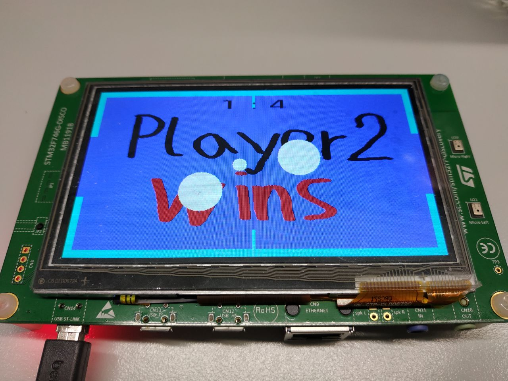

# Airhockey game based on stm32f7-discovery

 

Airhockey game for stm32f7 micro-controller written in Rust in course practical. 
## How to install & start
Follow the instructions down below and use  ``` $ cargo run --bin polling --release ``` to run the game.

## How to play:
Both players are controlled by touching the position the player should move to on their respective sites. The game ends if one player reaches 10 scoring points. To restart it run ``` $ cargo run --bin polling --release ```  again. 


# original stm32f7-discovery README:

## Building

- **Install the thumbv7em-none-eabihf target**: Run `rustup target add thumbv7em-none-eabihf`.
- **Run `cargo build`**

## Running

First you need to install some dependencies:

- **Install stlink**: See <https://github.com/texane/stlink#installation>.
- **Install openocd**: At least version 0.10.0 is needed. You can install it either from your package manager or [from source](https://sourceforge.net/projects/openocd/).
- **Install gdb-multiarch**: This cross-platform version of GDB should be available through your package manager.

Then you can connect your controller and run the following:

- **Start openocd**: In a separate terminal window, run `openocd -f board/stm32f7discovery.cfg`. You might need `sudo`. If you get an "Can't find board/stm32f7discovery.cfg" error your version of openocd might be too old (it should be at least 0.10.0).
- **Run `cargo run`**: This connects to the openocd instance and flashes your binary to the controller.
- **Continue execution**: By default GDB pauses the execution after loading. To continue your program, run `continue` or `c`.

To run in release mode (i.e. with optimizations), run `cargo run --release`.

## License

Licensed under either of

- Apache License, Version 2.0 ([LICENSE-APACHE](LICENSE-APACHE) or
  http://www.apache.org/licenses/LICENSE-2.0)

- MIT license ([LICENSE-MIT](LICENSE-MIT) or http://opensource.org/licenses/MIT)

at your option.

## Contribution

Unless you explicitly state otherwise, any contribution intentionally submitted
for inclusion in the work by you, as defined in the Apache-2.0 license, shall be
dual licensed as above, without any additional terms or conditions.
